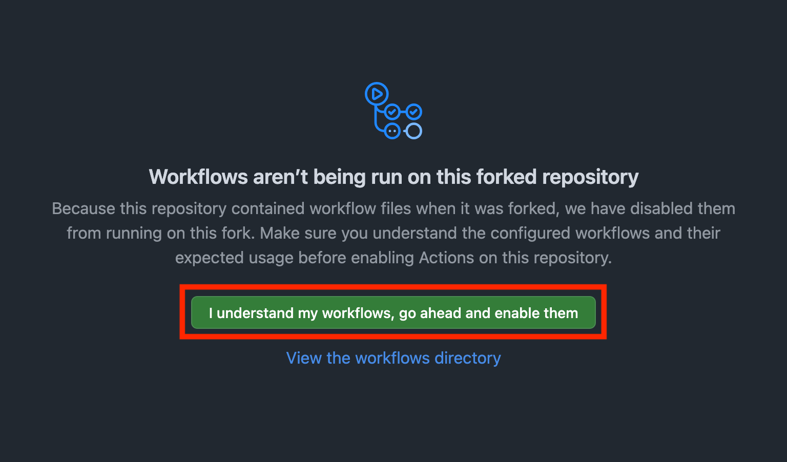

# Intro to Git & GitHub: Interactive Learning Module

Welcome! This repository is designed as a hands-on, interactive introduction to **Git** and **GitHub**. You'll learn the basics, explore common workflows, and practice using real tools like GitHub Actions, issue templates, and more.

---

## Table of Contents

1. [Git vs GitHub: What's the Difference?](#git-vs-github-whats-the-difference)
2. [Getting Started: Fork & Clone](#getting-started-fork--clone)
3. [Interactive Git Lessons](#interactive-git-lessons)
4. [Common Git Workflows](#common-git-workflows)
5. [GitHub Features](#github-features)
6. [Best Practices & Tips](#best-practices--tips)
7. [Troubleshooting Common Issues](#troubleshooting-common-issues)
8. [Repository Structure](#repository-structure)

---

## Git vs GitHub: What's the Difference?

- **Git** is a distributed version control system. It tracks changes to files and lets you collaborate with others.
- **GitHub** is a platform for hosting Git repositories online, enabling easier collaboration, as well automation, issue tracking, wikis, and more!

---

## Getting Started: Fork & Clone

1. **Fork and Clone This Repository**
   1. Go to the top of this page and click the **Fork** button.
      _This creates a copy of the repository under your GitHub account._

   2. Fill out the form if prompted, then click **Create fork**.

   3. Enable GitHub Actions on your fork:
      - Go to the **Actions** tab in your forked repository.
      - Click **"I understand my workflows, go ahead and enable them"**.
      - 

   4. Go back to the **Code** tab in your forked repository.

   5. Click the green **Code** button and copy the URL under "Clone with HTTPS".
      _It will look something like:_
      `https://github.com/YOUR_USERNAME/intro-to-git-and-github.git`

   6. Open your terminal and run:

      ```sh
      git clone $FORKED_REPO_URL   # Clone your forked repository to your computer
      ```

   7. Move into your cloned repository:

      ```sh
      cd intro-to-git-and-github   # Move into your cloned repository directory
      ```

   8. _(Optional)_ [See the GitHub docs for more info on forking and cloning.](https://docs.github.com/en/pull-requests/collaborating-with-pull-requests/working-with-forks/fork-a-repo#forking-a-repository)

---

## Interactive Git Lessons

Follow these steps in order, running each command in your terminal:

### 1. Check Your Remotes

```sh
git remote -v   # Show the URLs for your remote repositories (should show 'origin' pointing to your fork)
```

- Should show `origin` pointing to your fork.

### 2. View Commit History

```sh
git log --oneline   # Show a concise list of commits in your repository
```

### 3. Update a File

- Open `version.json` and update the `"version"` field (e.g., from `1.0` to `2.0`).

### 4. Check Status

```sh
git status   # Show the status of your working directory and staged files
```

- Shows `version.json` as modified (unstaged).

### 5. Stage the Change

```sh
git add version.json   # Stage your change to version.json for commit
git status             # See that version.json is now staged
```

- Now `version.json` is staged.

### 6. Commit the Change

```sh
git commit -m "version update"   # Commit your staged change with a message
git log --oneline                # See your new commit in the history
```

- Shows your new commit.

### 7. Push to Your Fork

```sh
git push   # Upload your commits to your fork on GitHub
git log --oneline   # Confirm your local branch is up to date
```

- Your fork is now up to date.

### 8. Check GitHub Actions

- Go to the **Actions** tab on GitHub to see the workflow triggered by your push to `main`. This workflow checks that your JSON files are valid.

---

### 9. Practice: Using `.gitignore`

The `.gitignore` file tells Git which files or folders to ignore (not track).

1. Open `.gitignore` in your editor.
2. Add a new entry, for example:
   ```
   secret.txt
   ```
3. Save and close the file.
4. Create a file named `secret.txt` in your repo:
   ```sh
   echo "This is a secret" > secret.txt   # Create a file that should be ignored by Git
   ```
5. Run:
   ```sh
   git status   # Check that secret.txt does not appear as an untracked file
   ```
   You should see that `secret.txt` is **not** listed as an untracked file—Git is ignoring it!

### 9. Create a New Branch

```sh
git checkout -b new-feature   # Create and switch to a new branch called 'new-feature'
```

### 10. Add a New File

- Create a new file `$YOUR_NAME.txt` with some content (e.g., "Hello from my branch!").
  For example:
  ```sh
  echo "Hello from my branch!" > $YOUR_NAME.txt   # Create a new file with your name
  ```

```sh
git status                        # See your new file as untracked
git add new.txt                   # Stage your new file for commit
git commit -m "add new file"      # Commit the new file with a message
git push -u origin new-feature    # Push your branch to your fork and set the upstream
```

### 12. Create an Issue Using the Template

- Go to the **Issues** tab on GitHub and click "New Issue."
- Select the **Bug Report** or **Feature Request** template.
- Fill out the template with a sample bug or feature idea and submit the issue.
- Note the issue number (e.g., #1).

---

### 13. Open a Pull Request to the Upstream Repository and Link to the Issue

- On GitHub, create a Pull Request from your fork's `main` branch to the **upstream/original repository's** `main` branch.
- **Use the provided Pull Request template** to describe your changes and follow the checklist.
- In the PR description, reference your issue by number (e.g., "Closes #1") or use the "Linked issues" section in the GitHub UI to link your PR to the issue you created.
- Check the **Actions** tab for the pull request workflow and status checks. This workflow will validate your changes and run additional checks before merging.
- Merge the pull request once the action is completed.

---

Suppose you have changes you aren't ready to commit, but need to switch branches.

1. Make a change to any file (but don't stage or commit it).
2. Save your work-in-progress:
   ```sh
   git stash   # Temporarily save your uncommitted changes
   ```
3. Your working directory is now clean. Switch branches or pull updates as needed.
4. When ready, restore your stashed changes:
   ```sh
   git stash pop   # Restore your stashed changes
   ```
5. Continue working or commit as usual.

---

### 17. Practice: Review Your Changes with `git diff`

Before staging or committing, it's good to see exactly what you've changed.

1. Make a change to any file (but don't stage it yet).
2. Run:
   ```sh
   git diff   # Show the differences between your working directory and the last commit
   ```
   This will show the differences between your working directory and the last commit.
3. After staging your changes, you can see the difference between staged and committed changes:
   ```sh
   git diff --staged   # Show the differences between staged changes and the last commit
   ```

---

### 15. Practice: Undoing Changes with `git reset`

Suppose you made a commit by mistake and want to undo it (locally).

1. Make a change and commit it:
   ```sh
   echo "Temporary" >> temp.txt      # Add a line to a new file
   git add temp.txt                  # Stage the new file
   git commit -m "temp commit"       # Commit the new file
   ```
2. To undo the last commit and keep your changes unstaged:
   ```sh
   git reset --soft HEAD~1   # Undo the last commit, keep changes staged
   ```
   Or, to undo and move changes back to working directory:
   ```sh
   git reset --mixed HEAD~1  # Undo the last commit, keep changes unstaged
   ```
   _Be careful: `git reset --hard HEAD~1` will permanently delete changes!_

---

### 16. Practice: Undoing Changes with `git revert`

Suppose you want to undo a commit but keep your history clean (recommended for shared branches).

1. Identify the commit hash to revert (use `git log`).
2. Run:
   ```sh
   git revert <commit-hash>   # Create a new commit that undoes the changes from the specified commit
   ```
3. This creates a new commit that undoes the changes from the specified commit.

---

---

## Common Git Commands Reference

Here are some common Git commands and what they do:

```sh
git status         # Show the status of your working directory and staged files
git add <file>     # Stage a file for commit
git add --all      # Stage all changes (new, modified, deleted files)
git commit -m "msg" # Commit staged changes with a message
git commit -am "msg" # Stage and commit all tracked files in one step
git commit --amend      # Amend the previous commit (default: opens editor to change the message)
git log            # Show commit history
git diff           # Show changes between working directory and last commit
git diff --staged  # Show changes between staged files and the last commit
git checkout <branch> # Switch to another branch
git checkout -b <branch> # Create and switch to a new branch
git branch         # List local branches
git branch -d <branch> # Delete a local branch
git push           # Push your commits to the remote repository
git pull           # Fetch and merge changes from the remote repository
git fetch          # Download new data from the remote repository (does not merge)
git stash          # Temporarily save uncommitted changes
git stash pop      # Restore stashed changes
git reset --soft HEAD~1   # Undo last commit, keep changes staged
git reset --mixed HEAD~1  # Undo last commit, keep changes unstaged
git revert <commit>       # Create a new commit that undoes the changes from a previous commit
```

Use this as a quick reference as you practice and explore Git!

---

## Common Git Workflows

- **Feature Branch Workflow:** Create a branch for each new feature or fix.
- **Forking Workflow:** Fork, clone, branch, PR—ideal for open source.
- **Handling Merge Conflicts:**
  - Create conflicting changes on two branches.
  - Attempt to merge and resolve conflicts manually.
  - Use `git mergetool` (optional).

---

## GitHub Features

- **Issues & Templates:** Use the "Issues" tab to report bugs or suggest features. Templates guide submissions.
- **Pull Request Templates:** Standardize PR descriptions for reviewers.
- **GitHub Actions:** Automated workflows for CI/CD. This repo has:
  - A workflow that runs only on the very first push to `main` (verifies the initial commit and branch structure).
  - A workflow that runs when you open or update a pull request (checks that your commit and branch structure matches the lesson exercises).
  - See `.github/workflows/` for details.
- **Wikis:** Use the "Wiki" tab to create and organize project documentation collaboratively.
- **Releases:** Use the "Releases" section to tag versions, provide release notes, and distribute packaged code.
- **Branch Protection Rules:** Prevent force-pushes and require PR reviews on `main`.
- **Code Review:** Use PRs for feedback and approval.

---

## Best Practices & Tips

- **Good Commit Messages:** Be clear and concise (e.g., "Fix typo in README").
- **Atomic Commits:** Each commit should do one thing (e.g., "Update README" or "Fix bug in version check"), not mix unrelated changes.
- **.gitignore:** Exclude files/folders like `node_modules/`, `.DS_Store`, etc.
- **README:** Keep your `README.md` up to date with setup instructions, usage, and project purpose so others can quickly understand and use your project.

---

## Repository Structure

```
.
├── README.md
├── version.json
├── .gitignore
└── .github
    ├── workflows
    │   └── ci.yml
    ├── ISSUE_TEMPLATE
    │   └── bug_report.md
    │   └── feature_request.md
    └── PULL_REQUEST_TEMPLATE.md
```

- **README.md:** This guide.
- **version.json:** Used for interactive exercises.
- **.gitignore:** Common patterns to exclude.
- **.github/workflows/main.yml:** Workflow for the first push to `main`.
- **.github/workflows/pr.yml:** Workflow for pull requests.
- **.github/ISSUE_TEMPLATE/**: Issue templates.
- **.github/PULL_REQUEST_TEMPLATE.md:** PR template.

---

## Next Steps

- Try the interactive lessons above.
- Explore the `.github/` folder for workflow and template examples.
- Experiment, break things, and use the troubleshooting section to recover!

Happy learning! 🚀
